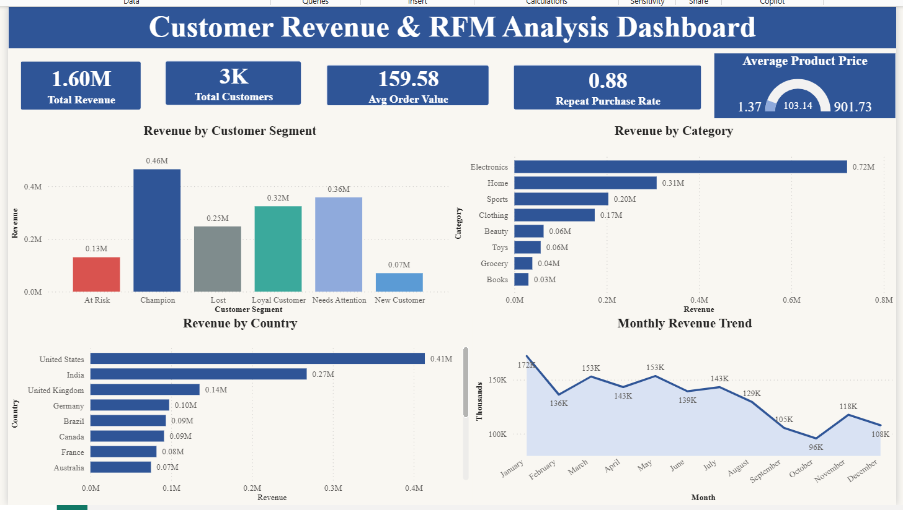

# 📊 Customer Revenue & RFM Analysis Dashboard

## 📌 Project Overview

This project presents an interactive **Power BI dashboard** designed to analyze customer revenue, purchasing behavior, customer segmentation, product categories, geographic performance, and monthly revenue trends.

The dashboard applies **RFM (Recency, Frequency, Monetary) analysis** to segment customers based on their purchasing behavior and provides business-focused insights that can support customer retention and revenue growth strategies.

---
## 📊 Dashboard Preview

## 🎯 Project Objectives

* Analyze overall customer revenue and purchasing behavior.
* Segment customers using RFM analysis.
* Identify high-value and at-risk customer segments.
* Analyze revenue contribution across product categories.
* Compare revenue performance across countries.
* Identify monthly revenue trends and variations.
* Provide actionable business recommendations based on the analysis.

---

## 🛠️ Tools & Technologies

* **Power BI**
* **Power Query**
* **DAX**
* **Data Cleaning & Transformation**
* **RFM Customer Segmentation**
* **Data Visualization**
* **Business Intelligence**

---

## 📈 Dashboard Overview

The dashboard provides an interactive view of customer and revenue performance through key performance indicators and visualizations.

### Key Performance Indicators

| Metric                |  Value |
| --------------------- | -----: |
| Total Revenue         |  1.60M |
| Total Customers       |     3K |
| Average Order Value   | 159.58 |
| Repeat Purchase Rate  |   0.88 |
| Average Product Price | 103.14 |

---

## 🔍 Key Insights

### 👥 Customer Segmentation

The **Champion** customer segment generated the highest revenue contribution at approximately **0.46M**, followed by **Needs Attention** at approximately **0.36M** and **Loyal Customer** at approximately **0.32M**.

This indicates that high-value customer segments contribute significantly to overall revenue.

### 🛍️ Revenue by Category

**Electronics** generated the highest revenue among the displayed categories, contributing approximately **0.72M**.

The next highest-performing categories were:

* Home — 0.31M
* Sports — 0.20M
* Clothing — 0.17M

### 🌎 Revenue by Country

The **United States** generated the highest revenue among the displayed countries at approximately **0.41M**, followed by:

* India — 0.27M
* United Kingdom — 0.14M
* Germany — 0.10M

### 📅 Monthly Revenue Trend

The highest monthly revenue shown in the dashboard was approximately **172K in January**.

Revenue declined to its lowest displayed point of approximately **96K in October**, followed by a recovery in November.

---

## 💡 Business Recommendations

Based on the dashboard analysis:

1. **Retain Champion Customers**
   Develop loyalty programs, personalized offers, and exclusive benefits for high-value customers.

2. **Re-engage At-Risk Customers**
   Use targeted campaigns and personalized promotions to encourage customers who may be becoming inactive.

3. **Focus on High-Performing Categories**
   Continue analyzing demand and customer preferences within high-revenue categories such as Electronics.

4. **Strengthen Performance in Key Markets**
   Prioritize customer acquisition and retention strategies in high-revenue countries while identifying opportunities in lower-performing markets.

5. **Investigate Seasonal Revenue Patterns**
   Analyze the causes of monthly fluctuations and use the findings to improve promotional and sales planning.

---

## 📁 Project Files

- [Customer Revenue RFM Analysis Dashboard.pbix](./Customer_Revenue_RFM_Analysis_Dashboard.pbix) — Power BI dashboard file
- [BI_Project_RFM.png](./BI_Poject_RFM.png) — Dashboard preview image
-  [orders.csv](./orders.csv) — Dataset used for the analysis

---

## 🚀 How to Use

1. Download the `.pbix` Power BI file from this repository.
2. Open it using **Microsoft Power BI Desktop**.
3. Explore the dashboard and interact with the available visualizations and filters.
4. Review the customer segments, revenue trends, category performance, and geographic analysis.

---

## 📌 Skills Demonstrated

**Data Analysis | Power BI | DAX | Power Query | RFM Analysis | Data Visualization | Business Intelligence | Customer Segmentation | Business Insights**

---

## 👤 Author

**Praveen Kumar R**

Aspiring Data Analyst focused on transforming data into actionable business insights.

---

⭐ If you find this project useful, feel free to explore the repository and connect with me on GitHub.
